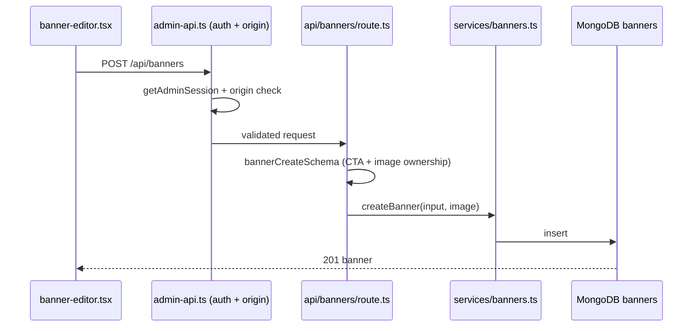
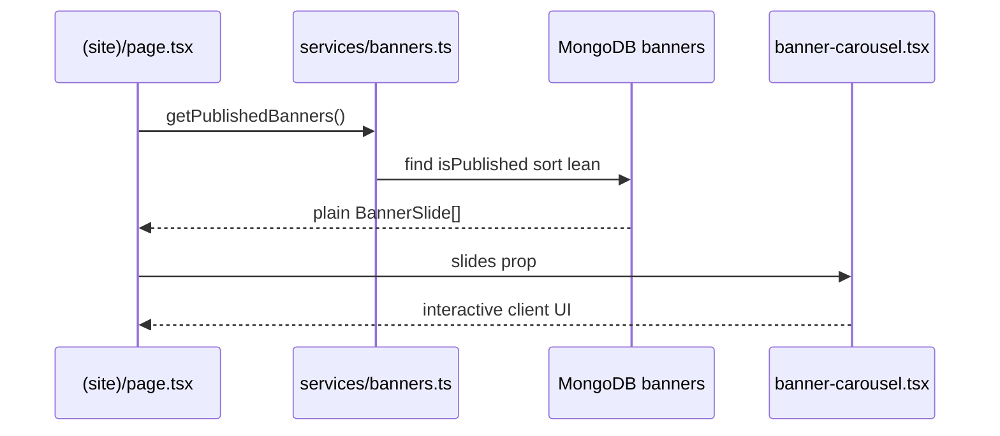

# Homepage banners and admin navigation

## What was built

- Public homepage banner carousel driven by the `banners` collection.
- A protected `/admin/banners` editor: create, edit, publish/unpublish, reorder,
  delete, and background-image upload to Cloudinary.
- A shared admin sidebar with expandable groups and separate editor routes.

## Content

No banner copy was recovered. The original `Alliance-Sourcing-BD` archive only
contained the consuming component and its model; the slide text lived in the
original project's own MongoDB, which this project never connects to. The admin
therefore starts in an honest empty state and the first slide is created by hand.
Nothing is seeded and no original database was contacted.

## Request flow: saving a slide



## Request flow: public page



## Admin routes

| URL | Page | Loads |
| --- | --- | --- |
| `/admin` | dashboard | session only |
| `/admin/settings/contact` | contact editor | site settings contact |
| `/admin/settings/logos` | logo uploads | site settings logos |
| `/admin/settings` | redirect | nothing, 307 to contact |
| `/admin/banners` | banner editor | all banner records |

The shared layout (`admin/(protected)/layout.tsx`) authorizes once and renders
only the sidebar plus `{children}`. Navigating between sections swaps the page
inside that layout; it never mounts every editor at once.

## Design decisions

- `src/lib/image-safety.ts` holds the SVG allowlist, magic-byte sniffing, format
  confirmation and animation rejection shared by the logo and banner pipelines.
  `logo-image.ts` and `banner-image.ts` only add their own processing profile, so
  the previously verified logo behaviour is unchanged.
- Banner backgrounds are scaled down to 2560px maximum width, never enlarged and
  never cropped. Opaque sources become high quality WebP; sources with alpha
  (rasterised SVG, transparent PNG) stay PNG. The 2 MiB input limit is unchanged.
- Uploads go to `alliance-sourcing-bd/banners` with a fresh UUID per asset.
  A record may only reference a `publicId` in that folder whose Cloudinary URL
  contains that id.
- Upload and save are separate steps. A failed upload therefore cannot touch the
  stored image, and a text-only edit omits the image field entirely so the saved
  image is kept. Old assets are retained, matching the logo pipeline; an upload
  that succeeds while the save fails leaves an unused Cloudinary asset that can be
  removed later from the Cloudinary console.
- Nothing is ever deleted from Cloudinary, so no arbitrary public id can be used
  to destroy an asset.

## Carousel accessibility and interaction fixes

The original component is preserved visually but its behaviour was corrected:

- Autoplay pauses on pointer hover, while focus is inside the carousel, when the
  user presses the pause/play control, and when `prefers-reduced-motion` is set.
- Prev/next/pause controls are always present and operable, not revealed on hover.
- Arrow keys, Home and End move between slides.
- Zero slides render a plain heading, one slide renders no redundant controls,
  and the rendered index is derived so a shortened slide list cannot dangle.
- Only the current slide renders the `h1` and the focusable CTA; other slides are
  `inert` and `aria-hidden`, which also keeps autoplay silent for screen readers.

## Next.js 16 notes

- Route handlers receive `params` as a promise, so `[id]/route.ts` awaits it
  before validating the id.
- Every page that reads the database is dynamic, which is why the build reports
  them as server-rendered on demand. There is no `fetch` to our own API from the
  homepage; the Server Component calls the service directly.
- `next/image`'s `priority` prop is deprecated in Next 16. The first slide, which
  is the above-the-fold LCP image, uses `loading="eager"` plus
  `fetchPriority="high"`, and the remaining slides stay lazy.

## Verification

```sh
npm test
npm run lint
npm run typecheck
npm run build
```

67 automated tests pass across `scripts/logo-upload.test.cjs` (27, unchanged
behaviour), `scripts/banner-api.test.cjs` (27) and `scripts/banner-render.test.cjs`
(13). They mock the admin session, the Mongoose model and the Cloudinary SDK, and
generate real image bytes including WebP, AVIF, SVG and an animated fixture. No
`.env` file is loaded and no saved content is mutated.

Not covered automatically: a real authenticated browser session, live Cloudinary
credentials, a live MongoDB write, and pixel-level visual comparison against the
original site. Timers and pointer/keyboard events are not executed by the
server-render harness; the carousel state helpers they drive are unit tested
instead.
