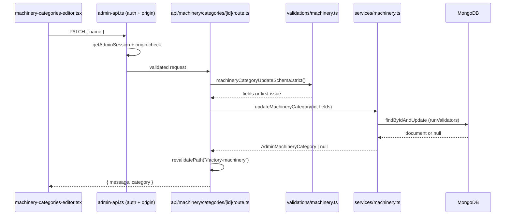

# Machinery inventory and the factory profile PDF

## What was built

`/factory-machinery`, split along the line the brief drew:

- **Static, no database.** Hero, "Own Factory" copy, "Advanced Machinery"
  cards and the closing CTA, with the bundled photographs
  (`factory-machinery-banner.JPG`, `thread-sucking-machine.png`,
  `needle-detector-machine.JPG`). Lives in
  `src/lib/factory-machinery-sections.ts` and the components in
  `src/components/machinery/`.
- **Database-driven.** The inventory tables, and the factory profile PDF the
  "Own Factory" buttons point at.
- **Admin.** `/admin/machinery/categories`, `/admin/machinery/items` and
  `/admin/machinery/factory-pdf`, under a Machinery group in the sidebar.

The page is a Server Component and reads the service directly; it never calls
our own API. `/api/machinery/inventory` exists for the published inventory for
any other consumer.

## Data model

```
machinery_categories   name (unique) · slug (unique) · sortOrder
machinery_items        categoryId · slNo · machineName · brand · quantity · sortOrder
machinery_settings     singleton { key: "main", factoryPdf }
```

`quantity` is the only number that is ever written. Every category total and the
grand total are summed at read time, so an admin edit cannot leave a stale
figure behind.

`brand` is nullable and a real value in this data (`"Open"` is a brand), so an
absent brand is stored as `null` and printed as a blank cell rather than
collapsed onto the machine name.

Seed contents, all verified against the reference site:

| Category | Machines | Units |
| --- | --- | --- |
| Cutting Machinery | 9 | 20 |
| Sewing Machinery | 8 | 213 |
| Finishing Machinery | 5 | 54 |
| Embroidery Machinery | 3 | 6 |
| **Total** | **25** | **293** |

## Migrations and seeders

MongoDB replaces SQL migrations. `npm run init:machinery`
(`scripts/init-machinery.ts`) is the one command:

1. `Model.init()` builds the declared indexes.
2. The unique name and slug indexes are created explicitly — `unique: true` in
   a schema is a declaration, not a guarantee, until the index exists.
3. Categories are inserted only if missing, and a category's machines are
   inserted only the first time that category is created.

Running it a second time adds nothing and preserves admin edits.

## The factory profile PDF

The reference page links `/files/factory-profile.pdf`, which returns 404, so
there is no file to copy. The PDF is therefore admin-managed:

- **Upload** `POST /api/machinery/factory-pdf/upload` — stored in Cloudinary
  under `alliance-sourcing-bd/documents` as a **raw** asset, because a PDF must
  be delivered unchanged. 10 MB ceiling, and the document is identified by its
  leading `%PDF-` bytes rather than by its filename or declared MIME type.
- **Publish** `PATCH /api/machinery/factory-pdf` with `{ pdf }` or `{ pdf: null }`.
  The record is stored separately from the upload, so a failed upload can never
  replace the document the page is already serving, and `null` makes the
  download buttons disappear instead of linking to a file that is gone.

A stored reference is only accepted if its `publicId` is inside the documents
folder *and* its URL path matches that publicId on `res.cloudinary.com` — the
same cross-folder guard the banner and logo editors use.

## Request flow: saving a category



Deleting a category takes the category document first and then its machines, so
a failed category delete can never strand machines under a category that is no
longer there. A reorder is refused with 409 unless it names every id in that
category exactly once, which is what stops two concurrent reorders from leaving
a gap. Item reordering renumbers `sortOrder` and `slNo` together, so the order
the reader sees cannot drift from the "No." column.

## Tests

```bash
npm run test:machinery
```

`machinery-schema.test.cjs` covers the validation rules and the PDF
cross-folder guard; `machinery-route.test.cjs` covers the request contract with
the service and `next/cache` stubbed — status codes, id validation, the
duplicate-key 409, cascade deletion, and that no write happens when the session
is missing.
